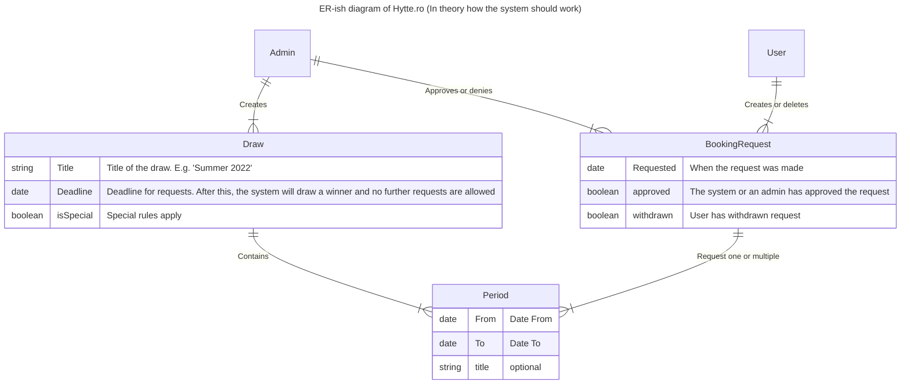

# Hytte.ro: Your Cabin Booking Solution

Welcome to Hytte.ro, a comprehensive solution for cabin booking based in Stavanger. This project is designed to streamline the process of booking and managing cabin reservations, making it easier for both administrators and users. 

You can view the design and user interface prototype for Hytte.ro on Figma [here](https://www.figma.com/design/uq5qeXZh25cjfIaOtZmtXy/Kabinizer-%E2%9C%A8-Enhanced-%F0%9F%A7%9A?node-id=0%3A1&t=aQ2dogROHVA1RqDf-1).

Before you get started, please review the overview and architecture of the system. 

If you have any questions or need assistance, please don't hesitate to reach out to the project team on slack or
email [kabinizer-support-aaaamw5kclgfndz6ufcdnfxbfq@miles-no.slack.com](mailto:kabinizer-support-aaaamw5kclgfndz6ufcdnfxbfq@miles-no.slack.com).

## Why Hytte.ro?

The previous name, "Kabinizer 3000" was from a time when we were still figuring out what we wanted to be.
We've since evolved and found our true calling: to be the go-to cabin booking solution for Miles employees in Stavanger.

The previous name, "Kabinizer," used "kabin," which typically refers to an airplane cabin or a ship's cabin.
That didn't quite hit the mark. 

Sure, "Kabinizer" sounded good when spoken out loud, but it didn't quite capture the cozy cabin vibes we were aiming for. So, we decided to switch things up and find a name that truly resonates with our vision. That's when "Hytte.ro" came into play! 

After a few caffeine-fueled searches, we stumbled upon the TLD “.ro,” and it just clicked.

In Norwegian, "hytte" means "cabin," perfectly capturing the essence of what we're all about. Plus, the ".ro" ending? It exudes calm and peace (literally, "ro" means "peace" in Norwegian). 

So, here we are, all set to offer you the slickest, friendliest cabin booking solution out there.

## System Overview and Architecture

Hytte.ro's main aim is to organize cabin raffles in the Stavanger area. Users can request a specific period, and once
the deadline is reached, the system randomly picks a user to be awarded that period.

The system is designed with administrators in mind, making it easy for them to keep track of requests and allocations.

> Please note that the first version of the system won't support automatic draws. This feature will be added in a later
version. For now, the admin will have to draw the winner manually.

Here's a simple "ER"-ish diagram of the system to help you get a grip on the system's terminology and structure.

## Frontend

Our frontend is built with React and TypeScript, providing a robust and dynamic user interface. It includes features
such as user login/logout, period selection and saving, and data download for admins. Future enhancements include the
addition of new periods by admins, a lottery system for period selection, and a variety of user-friendly features like
shopping lists, check-in/check-out systems, and email notifications.

For more details, please refer to the [kabinizer-front-end](kabinizer-front-end/README.md) documentation.

## Backend

The backend of Hytte.ro is a controller-based .NET 8 web API, utilizing Entity Framework as an object-relational
mapper (ORM). It includes a Docker Compose file for setting up a SQL Server database, making it easy to manage and
access data.

For more information, please see the [kabinizer-back-end](kabinizer-back-end/README.md) documentation.

