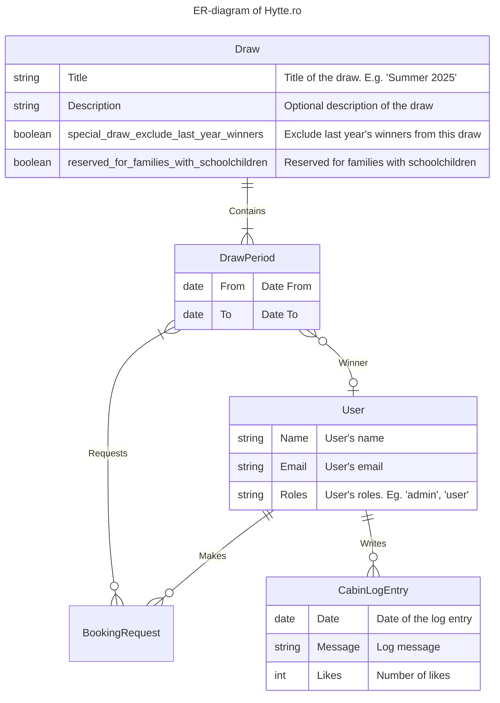

# Tables

## Draws

| Column Name                               | Data Type    | Description                                |
|-------------------------------------------|--------------|--------------------------------------------|
| ID                                        | INT          | Primary Key                                |
| Title                                     | VARCHAR(255) | Title of the draw. E.g. 'Summer 2025'      |
| Description                               | VARCHAR(255) | Optional description of the draw           |
| special_draw_exclude_last_year_winners    | BOOLEAN      | Exclude last year's winners from this draw |
| reserved_for_families_with_schoolchildren | BOOLEAN      | Reserved for families with schoolchildren  |

## DrawPeriods

| Column Name | Data Type | Description                      |
|-------------|-----------|----------------------------------|
| ID          | INT       | Primary Key                      |
| From        | DATE      | Date From                        |
| To          | DATE      | Date To                          |
| DrawID      | INT       | Foreign Key referencing Draw(ID) |

## Users

| Column Name | Data Type    | Description                       |
|-------------|--------------|-----------------------------------|
| ID          | INT          | Primary Key                       |
| Name        | VARCHAR(255) | User's name                       |
| Email       | VARCHAR(255) | User's email                      |
| Phone       | VARCHAR(255) | User's phone number               |
| Roles       | VARCHAR(255) | User's roles. Eg. 'admin', 'user' |

## BookingRequests

| Column Name  | Data Type | Description                            |
|--------------|-----------|----------------------------------------|
| ID           | INT       | Primary Key                            |
| who          | INT       | Foreign Key referencing User(ID)       |
| DrawPeriodID | INT       | Foreign Key referencing DrawPeriod(ID) |

## CabinLogEntries

| Column Name | Data Type | Description                      |
|-------------|-----------|----------------------------------|
| ID          | INT       | Primary Key                      |
| Date        | DATE      | Date of the log entry            |
| Message     | TEXT      | Log message                      |
| Likes       | INT       | Number of likes                  |
| written_by  | INT       | Foreign Key referencing User(ID) |

