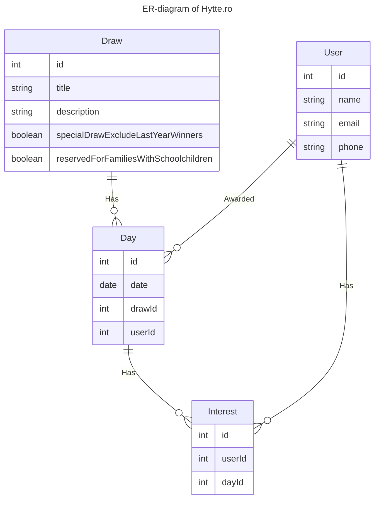
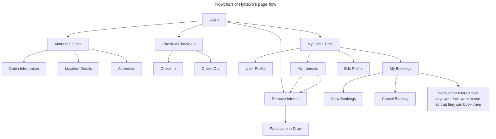

# Hytte.ro overview

## Flowchart

## Interest vs Booking

Interests are a way to show that you want to use a certain day.
Booking is a day that is awarded to you if you win the draw.

## Relation 
- a draw can contain many days.
- a day can belong to one draw.

- interest can contain one day
- day can belong to one interest

# Tables

- Draw
- DrawDays
- Day
- DayInterests
- Interest
- UserInterests
- User
- UserBookings
- Booking
- BookingDays
